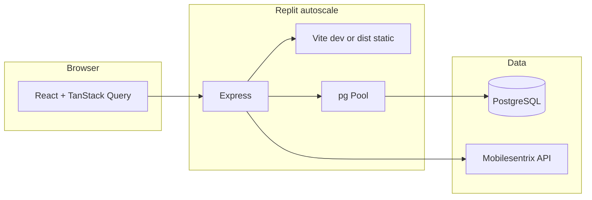

# Performance and functionality improvements

## Architecture (as implemented)

---

## 1. Critical: duplicate session middleware (correctness + perf)

**Problem:** Session is registered twice with incompatible configuration:

- [`server/index.ts`](server/index.ts): `connect-pg-simple` table `session`, `maxAge` 8h, `secure` only when `NODE_ENV === "production"`.
- [`server/routes.ts`](server/routes.ts): second `session()` with table `sessions`, `maxAge` 7d, `secure: true` always.

Both stacks run on every request (`registerRoutes` is called from `index.ts` after the first `app.use(session(...))`). That doubles session work and risks **lost or inconsistent `req.session`** (different stores keyed by the same cookie name), which directly affects admin login and any session-based behavior.

**Recommendation:** Keep **one** session configuration in a single module (e.g. only [`server/index.ts`](server/index.ts)), remove the duplicate block from [`server/routes.ts`](server/routes.ts), and align `tableName` with the table that actually exists in your DB (verify in production: `session` vs `sessions`). Align `trust proxy`, `cookie.secure`, and `maxAge` in one place.

---

## 2. Hot path: quote pricing (largest real-world win)

### 2a. Server: unbounded parallel SKU work

[`getSkuPricesBatch`](server/routes/quotes.ts) uses `Promise.all(uniqueSkus.map(sku => getSkuPrice(sku)))`. Each `getSkuPrice` can hit the DB many times (`getMessageTemplates` repeatedly) and, for API pricing, the network.

You already implemented **batched, throttled API fetching** in [`fetchAndCacheMultipleSkus`](server/mobilesentrix.ts) (batches of 10, delay between batches)—but it is only used from [`server/routes/integrations.ts`](server/routes/integrations.ts), **not** from the quote routes.

**Recommendation:** Refactor the Mobilesentrix branch of pricing so quote calculation reuses `fetchAndCacheMultipleSkus` (or the same batching policy) instead of N unbounded parallel `getProductBySku` calls. Keep Excel/supplier path as fast lookups (consider batching `getSupplierPartBySku` via a single `WHERE sku IN (...)` if many SKUs).

### 2b. Repeated `getMessageTemplates()`

[`roundPrice`](server/routes/quotes.ts), [`getSkuPrice`](server/routes/quotes.ts), and several handlers call `storage.getMessageTemplates()` over and over for one HTTP request.

**Recommendation:** Load templates once per request (pass a `templates` object into helpers) or add a short in-memory TTL cache (e.g. `memoizee` with 30–60s TTL, invalidation on admin template updates if you add that hook).

### 2c. Client: N parallel `/api/calculate-quote/:id` calls

In [`use-quote-wizard.ts`](client/src/hooks/use-quote-wizard.ts), `handleDirectServicesView` does `Promise.all(services.map(... fetch /api/calculate-quote/${ds.id}))`. A device with many services generates **many concurrent server requests**, each repeating SKU and template work.

**Recommendation:** Add something like `POST /api/calculate-quotes` with `{ deviceServiceIds: string[] }` (or `deviceId` and compute server-side) that:

- Loads device services once,
- Collects **all** SKUs across rows,
- Resolves prices in one batched pipeline,
- Returns an array of quote DTOs.

Then the hook makes **one** request. This improves latency, reduces connection churn, and plays better with Replit autoscale.

---

## 3. Logging and privacy (performance + compliance)

[`server/index.ts`](server/index.ts) middleware logs **full JSON bodies** for `/api` responses (`JSON.stringify(capturedJsonResponse)`). That can log **PII** (emails, phones, quote details), bloat logs, and add CPU overhead.

**Recommendation:** Log method, path, status, duration, and optionally a **bounded** sanitized summary; never dump full customer payloads in production. Gate verbose logging behind `NODE_ENV !== "production"` or a `DEBUG_API_LOGS` flag.

---

## 4. Replit autoscale vs in-memory caches

- [`getDeviceSearchData`](server/middleware.ts): 2-minute in-memory cache for device search.
- [`partsCache`](server/mobilesentrix.ts): in-memory map backed by DB table `parts_price_cache` (good).

With **[deployment] `autoscale`** in [`.replit`](.replit), **each instance has its own memory**. Device search cache can be **stale** (admin updates devices; some users see old data until TTL) or **inconsistent** between instances. Parts cache is less problematic because you persist to PostgreSQL.

**Recommendation:** Rely on DB + HTTP `Cache-Control` for reference data, shorten TTL, or add invalidation via DB notifications only if needed. For strict consistency, move hot shared cache to Redis or accept “eventual consistency” and document it.

---

## 5. Database pool and connections

[`server/db.ts`](server/db.ts) uses `new Pool({ connectionString })` with defaults. Serverless/autoscale + many concurrent quote requests can open many connections.

**Recommendation:** Set explicit `max`, `idleTimeoutMillis`, and (if your host recommends) `connectionTimeoutMillis`. Tune to Replit Postgres limits. Consider `pg` pool `max` in the **single digits** per instance if each instance is small and many instances exist.

---

## 6. HTTP caching and static assets

Several read APIs set `Cache-Control: public, max-age=300` (e.g. [`server/routes/devices.ts`](server/routes/devices.ts), [`server/routes/services.ts`](server/routes/services.ts))—good for the public wizard.

[`server/static.ts`](server/static.ts) uses `express.static(distPath)` without long-cache for hashed filenames. Vite emits hashed assets under `dist/public`.

**Recommendation:** Serve `/assets/*` (or known hashed paths) with `maxAge` / `immutable` so repeat visits are faster; keep `index.html` non-cache or short-cache for SPA updates.

---

## 7. Security and abuse (functionality under load)

There is **no** application-level rate limiting on public endpoints (`/api/devices/search`, `/api/calculate-quote/*`, quote submission). Dependencies include `compression` but not `express-rate-limit` in [`package.json`](package.json) (build allowlist mentions it; verify if unused).

**Recommendation:** Add rate limits (per IP) for search, calculate-quote, and quote POST routes to reduce abuse and protect Mobilesentrix + DB. Combine with duplicate-session fix so limits apply to a stable session/cookie story.

---

## 8. Smaller functional/UX improvements (optional)

- **Health check:** A lightweight `GET /api/health` (DB ping) helps Replit/deploy probes and debugging.
- **Admin tabs:** Ensure heavy tabs use pagination (parts already have `getPartsPaginated` in storage)—avoid loading unbounded lists where not needed.
- **Embed route:** If [`client/src/pages/embed.tsx`](client/src/pages/embed.tsx) is iframe-embedded, confirm CORS/cookies/`SameSite` behavior for third-party sites (often requires explicit embedding strategy).
- **Error boundaries:** You have [`ErrorBoundary`](client/src/components/ErrorBoundary.tsx)—ensure async errors in the wizard surface user-friendly messages.

---

## Suggested implementation order

| Priority | Item | Impact |
|----------|------|--------|
| P0 | Remove duplicate session; single store + one table | Auth reliability, fewer DB round-trips |
| P0 | Stop logging full API JSON in production | Privacy, log size, CPU |
| P1 | Batch quote calculation API + client single call | Latency, fewer API calls to Mobilesentrix |
| P1 | Align SKU batching with `fetchAndCacheMultipleSkus` | Rate limits, stability |
| P2 | Cache `getMessageTemplates` per request or TTL | DB load |
| P2 | Tune `pg` pool + static asset cache headers | Scale, repeat visit speed |
| P3 | Rate limits + health endpoint | Abuse resistance, ops |

---

## Files to touch (when implementing)

- Session: [`server/index.ts`](server/index.ts), [`server/routes.ts`](server/routes.ts)
- Pricing: [`server/routes/quotes.ts`](server/routes/quotes.ts), [`server/mobilesentrix.ts`](server/mobilesentrix.ts)
- Client batching: [`client/src/hooks/use-quote-wizard.ts`](client/src/hooks/use-quote-wizard.ts), new route in quotes router
- Infra: [`server/db.ts`](server/db.ts), [`server/static.ts`](server/static.ts), [`server/middleware.ts`](server/middleware.ts) (cache strategy)

No database migration is strictly required for the session fix if you standardize on the table that already exists—verify the live schema name before changing `tableName`.
